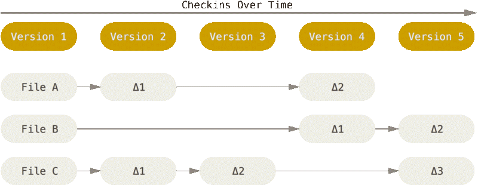
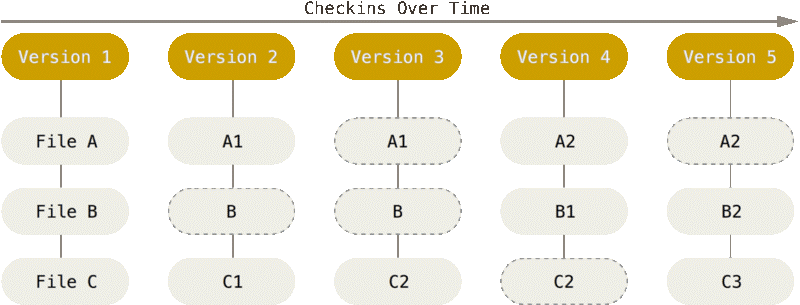

# Part 0. Preparation
## Course overview
Добро пожаловать на курс по менеджменту проектов с помощью системы контроля версий Git и вебсайту GitHub. Целью этого курса есть демонстрация всех гит команд, которые я использую в своей повседневной работе, а также более детальное изучение команд и подходов к определённым ситуациям и структуризация моих знаний.

В этом курсе мы рассмотрим следящие пункты: 
 - Работа с репозиторием
 - Работа с коммитами
 - Работа с ветками
 - Merge
 - Rebase
 - Работа с проектом (submodule)

## Common gist of git
Представьте себе компанию хотя бы из 10 человек, которые разрабатывают какой-либо продукт (веб приложение, игру, настольное приложение). Главный вопрос, который нас тревожит.

*Как объединить индивидуальный результат работы людей в единый проект ?*

Перекидывать файлы с компьютеров на другие компьютеры совершенно неудобно. Поэтому люди придумали систему контроля версий.

Большинство СКВ хранят информацию в виде списка изменений в файлах. Эти системы (CVS, Subversion, Perforce, Bazaar и т.д.) представляют хранимую информацию в виде набора файлов и изменений, сделанных в каждом файле, по времени (обычно это называют контролем версий, основанным на различиях).



В Git принято по другому. Он хранит снимки. Снимок это состояние проекта в текущей момент времени. Если Вы изменили файл и сделали коммит, то Git сохраняет целяком новый файл и «ссылки» на файлы, что не изменились. Таким образом, получается миниатюрная файловая система. 



## Terminology

### git

### GitHub

### Repository

### Commit

### Branch

### HEAD

### Merge

## Installation

### Windows

Официальная сборка доступна для скачивания на [официальном сайте Git](http://git-scm.com/download/win). Обратите внимание, что это отдельный проект, называемый Git для Windows; для получения дополнительной информации о нём перейдите на [Git for Windows](https://gitforwindows.org).

### MacOs
Существует несколько способов установить гит на macOs:
 - Homebrew
   Установите [Homebrew](https://brew.sh/), потом выплните команду.
   ```brew install git```
 - XCode
   Apple предоставляет git вместе с [XCode](https://developer.apple.com/xcode/).
 - Бинарный установщик
   Tim Harper предоставляет [установщик](https://sourceforge.net/projects/git-osx-installer/) гита для macOs. 

## Configuration
Каждый инструмент перед началом использования следует настроить. В нашем случае git - наш инструмент. Задать параметры гиту можно глобально и локально. Сейчас настроим гит глобально, а локальную настройку рассмотрим позже.

Чтобы посмотреть настройки введите команду:
```git config --list```
Также можно добавить флаг `--show-origin`, чтобы посмотреть где хранится та или иная настройка.

Для работы в git установим две переменных: имя и электронную почту.
```git config –-global user.name “Ivan Kovalenko” ```
```git config –-global user.email “s1ckretbox@gmail.com” ```
