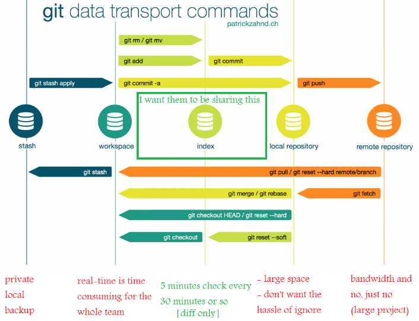
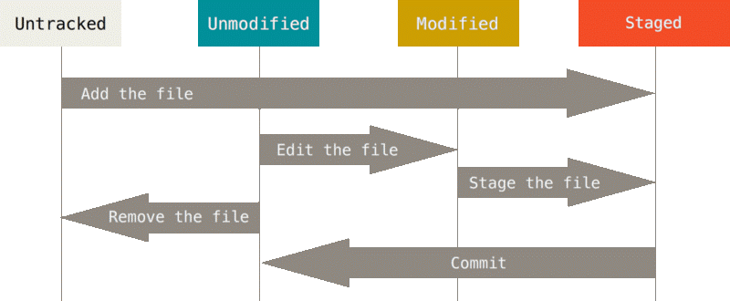

# Part 1. Commits
## A. Creating a local repository
Части номер 1, 2 и 3 мы будем работать в локальном репозитории. В части номер 4 мы рассмотрим общение с удалённым репозиторием. Чтобы превратить папку в репозиторий пропишем команду 
```bash
git init
```
Отлично. Теперь мы сможем создавать коммиты. Напоминаю что коммит - это снимок репозитория (всех файлов).
## B. Git workflow
### Рассмотрим как происходит работа с системой git.
Git имеет 5, так сказать, зон:


 - Сундук, Тайник (stash) - хранилище изменений, которые Вам пока что не нужны. Вы сможете применить из позже.
 - Рабочая область (workspace) - дерево папок с файлами, которые Вы видите и можете изменить.
 - Индекс (index) - это промежуточная область между workspace and local repository. Вы можете использовать index для подготовки набора изменений в файлах, из которых желаете сделать один коммит.
 - Локальный репозиторий (local repository) - репозиторий на Вашем компьютере. Репозиторий это папка `.git`.
 - Удалённый репозиторий (Remote repository) - репозиторий на серверах GitHub / GitLab.
 
 Особое внимание стоит уделить области index. Давайте запомним, что index используется как буфер между workspace and local repository. Чтобы совершить коммит мы используем индекс, помещая в него изменения. Когда Вы создаёте коммит индекс опустошается.
## C. File status lifecycle
### Рассмотрим жизненный цикл файла в репозитории.
У файла бывает всего 4 состояния:
| __File Status__ | __Description__                                                                  |
|-----------------|----------------------------------------------------------------------------------|
| Untracked       | Эти файлы не отслеживаются системой git. Он их увидел впервые.                   |
| Unmodified      | Эти файлы отслеживаются системой git.                                            |
| Modified        | Эти файлы отслеживаются системой git. Мы их изменили и git нам про это сообщает. |
| Staged          | Эти файлы помещены в индекс и готовы к коммиту.                                  |


### Рассмотрим диаграмму состояний файла



Представим что мы добавили файл _story.txt_ в репозиторий.  Система git впервые увидела этот файл.
> File status: __untracked__.

```
> File: story.txt
Тёплым летним днём я шёл по лесу. 
Слушал хруст почвы и шелест листвы у меня под ногами.
```
Если мы будем изменять этот файл сейчас, когда его статус untracked, то git не сможет зафиксировать изменения. Чтобы он смог это сделать добавим файл в индекс. 
> File status: __staged__.

Сделаем коммит, чтобы гит запомнил файл. 
> File status: __unmodified__.

Теперь можем изменять файл и сохранять снимки репозитория. Добавим в нашу история чего-то нового.

```
> File: story.txt
Тёплым летним днём я шёл по лесу. Моей целью был родник со свежей прохладной водой. 
По дороге слушал хруст почвы и шелест листвы у меня под ногами. 
Вдруг встретил поляну дикой земляники. 
Жаль, что я не могу почуять её аромат.
```
> File status: __modified__

Теперь мы снова можем помещать файл в индексe совершать коммит. Отлично. Мы рассмотрели все состояния файла.

> __Запомните:__ индекс и workspace это две разные зоны. Мы можем изменить файл, добавить его в индекс (туда копируется изменения), потом снова изменить файл, но он автоматически в индекс __не добавится!__ Если мы пропишем git status, увидим наш файл имеет статус _staged_ и _modified_. 

## D. Commands
### git status

Самая частая команда, которую Вы будете использовать - `git status`. Позволяет посмотреть состояние репозитория:
 - на какой мы сейчас ветке
 - untracked, modified, deleted, staged файлы

Если файлы находятся в папке, то git отображает только папку. Чтобы увидеть все файлы добавте ключ -u (--untracked-files).
```
git status -u
# or
git status --untracked-files
```
Также есть возможность указать мод. -u[<mode>] (--untracked-files=[<mode>]).

| __Mode__ | __Description__                |
|:--------:|--------------------------------|
|    no    | не показывать untracked files  |
|  normal  | показывать файлы и папки       |
|    all   | показывать файлы индивидуально |

```
git status -uno
git status -unormal
git status -uall

# or

git status --untracked-files=no
git status --untracked-files=normal
git status --untracked-files=all
```
По стандарту ключ -u в режиме all. Поэтому советую применять просто ключ -u, без явного указания модификации.

### git add

Команда добавляет файлы в индекс. Вы можете перечислять столько файлов, сколько Вам захочется. Также можно применять регулярные выражения.
Рассмотрим дополнительные варианты:

|   __Command__  | __Untracked files__ | __Modified files__ | __Deleted files__ | __Description__                                                                                                                                          |
|:--------------:|---------------------|--------------------|-------------------|----------------------------------------------------------------------------------------------------------------------------------------------------------|
| __git add -A__ |         Yes         |         Yes        |        Yes        | Добавляет в индекс все файлы                                                                                                                             |
| __git add .__  |         Yes         |         Yes        |       __NO__      | Добавляет в индекс все файлы, кроме удалённых                                                                                                            |
| __git add *__  |          -          |          -         |         -         | Функционал * зависит от оболочки, которую вы используете. Это не синтаксис гита. Обычно добавляет в индекс все файлы, кроме тех, что начинаются с точки. |
| __git add -u__ |        __NO__       |         Yes        |        Yes        | Добавляет в индекс все файлы кроме untracked.                                                                                                            |

### git diff

С помощью `git diff` мы можем посмотреть разницу файлов, коммитов, веток. Мы будем рассматривать новые применения этой команды по мере продвижения курса. 
Напоминаю, что HEAD это ссылка(указатель) на коммит. В нашем случае HEAD это последний коммит. Текущий workspace это как раз и есть коммит на который указывает HEAD.

|      __Command__      | __Description__                             |
|:---------------------:|---------------------------------------------|
| __git diff__          | Показывает изменения между HEAD и workspace |
| __git diff --cached__ | Показывает изменения между HEAD и индексом  |

### git commit
Это команда создаёт коммит. Очевидно. Рассмотрим флаги. Каждый коммит должен быть с сообщением или подписью.
|      __Flag__      | __Description__                                                                                       |
|:------------------:|-------------------------------------------------------------------------------------------------------|
| __-m__ (--message) | Добавляет сообщение к коммиту                                                                         |
|  __-s__ (--signof) | Добавляет подпись к коммиту                                                                           |
|   __-a__ (--all)   | Автоматически добавляет modified и deleted _(кроме untracked!)_ файлы в индекс, а потом делаем коммит |
|     __--amend__    | Позволяет изменить коммит на который указывает HEAD                                                   |

Правила оформления сообщения коммитов рассмотрим в практической части.

### git rm
Удаляет файлы с репозитория, а именно с конкретного снимка. Эта команда не сможет удалить те файлы, которые ещё не под системой git.
|      __Flag__      | __Description__                                    |
|:------------------:|----------------------------------------------------|
| __-n__ (--dry-run) |  Не удаляет файлы. Пишет какие файлы будут удалены |
|       __-r__       | Позволяет удалить папки и файлы рекурентно         |
|     __--cahed__    | Удаляет файлы __только__ с индекса                 |

### git log

Команда `git log` позволяет посмотреть историю коммитов на текущей ветке. 
|     __Flag__     | __Description__                                                            |
|:----------------:|----------------------------------------------------------------------------|
|   __--oneline__  | Показывает короткий хэш и заголовок коммита                                |
|      __-n__      | Показывает _n_ последних коммитов                                          |
|     __--all__    | Показывает все коммиты в истории _(Советую использовать вместе с --graph)_ |
|    __--graph__   | Показывает графическое отображение истории (веток)                         |
| __-p (--patch)__ | Показывает разницу между коммитами                                         |

Эта команда может фильтровать коммиты по разным параметрам: дата, автор и тд. Посмотрите документацию, если Вам нужен такой функционал.
Советую пользоваться флагом __--help__ для просмотра документации. Там есть все флаги, а также примеры. 
> Ex: git log --help

### git restore / git checkout --

Допустим мы отредактировали файл, но решили отменить изменения. Для этого существует две команды: новая `git restore` и старая `git checkout --`. 
Последняя команда как швейцарский нож, многофункциональна. Она отвечала за переключения между ветками, создания веток и отменение изменений. В новых версиях разделили этот функционал.
Эти команды востанавливают файлы в workspace до состояния HEAD.
```
# For example we have lake_trip.txt file which status is _modified_.
> File: lake_trip.txt (state: __HEAD__)
Утром в 4:34 наблюдал за превосходным нежно-персиковым восходом солнца.

> File: lake_trip.txt (state: __modified__)
Проснулся утром в 4:34. Я наблюдал за превосходным нежно-персиковым восходом солнца.
```

Командой `git restore lake_trip.txt` или `git checkout -- lake_trip.txt` мы отменим изменения, тем самым статус файла станет _unmodified_.

Детальнее рассмотрим команду `git restore`.

|       __Flag__      | __Description__                                                      |
|:-------------------:|----------------------------------------------------------------------|
| __-W (--worktree)__ | Восстанавливает workspace к HEAD (этот флаг установлен по умолчанию) |
|  __-S (--staged)__  | Восстанавливает _только_ индекс (то есть очищает его)                |

Обратите внимание на флаги. Они в верхнем регистре. Также, можно использовать два флага сразу. Результат - очистка индекса и workspace.

## E. Helpful files

### .gitkeep

Иногда полезно создать структуру папок, а потом добавлять файлы. Но гит не видит пустые папки. Поэтому люди приняли, чтобы добавить пустую папку, в этой папке следует создать файл .gitkeep. Это обычный файл. Это не официальная функция гита. Просто общее согласие людей.

### .gitignore

А вот .gitignore уже официальная функция гита. В этом файле можно записать те файлы и директории, которые гит будет игнорировать, то есть не отслеживать. Также можно добавить исключения из правил, поставив __!__ перед файлом/папкой. Поддерживает регулярные выражения.
Пару советов:
 
 - `<dir-name>/` - Если имя заканчивается слешом, значит git будет игнорировать все файлы и папки (рекурсивно) в <dir-name>.
 - `<dir-name>` - Просто игнорирует файл <dir-name>
 - `<dir-name/*.*` - Игнорирует только файлы в папке <dir-name>. Не игнорирует папки(что в <dir-name>) и файлы в них.
# The end of part 1!
Надеюсь этот материал стал Вам полезен! Желаю Вам всего хорошего.  
